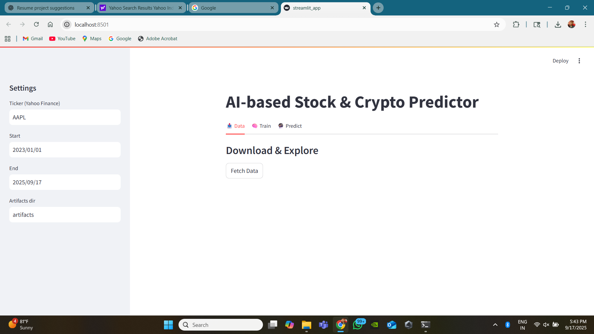
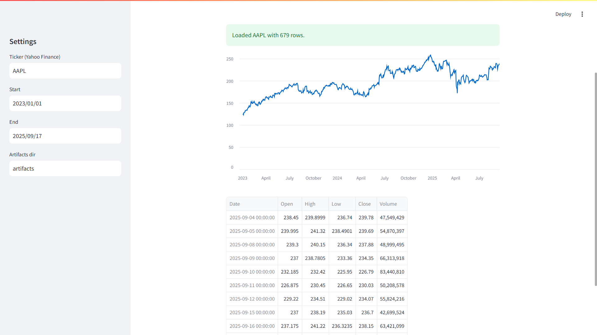
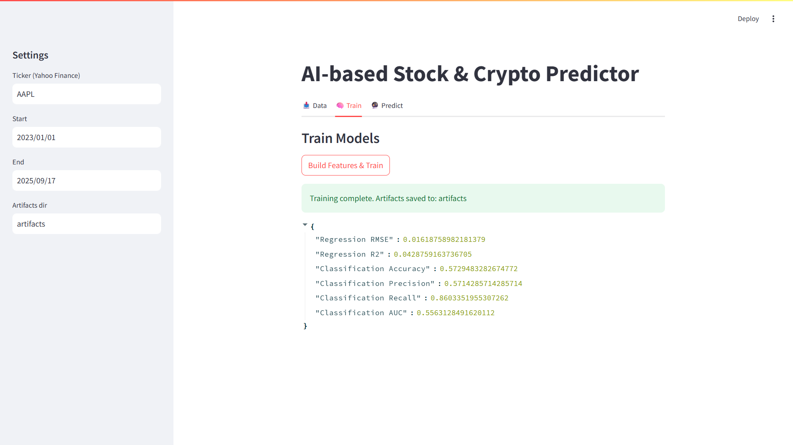
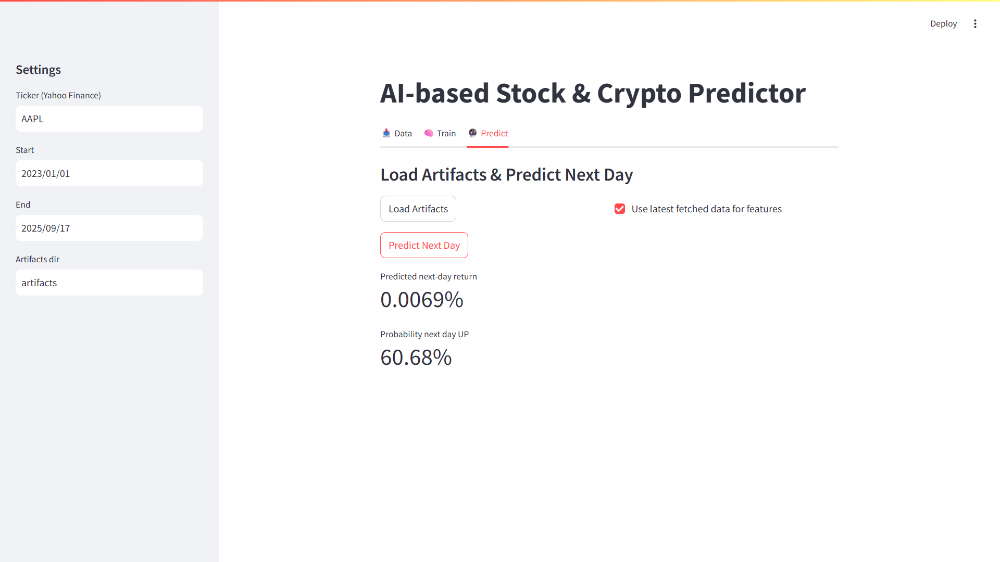

# AI-based Stock & Crypto Predictor  

This project is a **machine learning web app** that predicts the **next-day price movement** (up/down) and **expected return** for stocks and cryptocurrencies. I built it as part of my portfolio to apply ML concepts on real financial data.  

---

## 🔹 Features
- Fetches **historical OHLCV data** from Yahoo Finance (`yfinance`)  
- Generates **technical indicators** (moving averages, RSI, MACD, volatility, lagged returns)  
- Trains two ML models:  
  - **Linear Regression** → next-day return prediction  
  - **Logistic Regression** → probability of market going up/down  
- Interactive **Streamlit dashboard** to:  
  - Explore raw and processed data  
  - Train models and save artifacts  
  - Run **next-day prediction** with probabilities  

---

## 🔹 Tech Stack
- **Python** (pandas, NumPy, scikit-learn)  
- **Data**: Yahoo Finance API via `yfinance`  
- **Frontend**: Streamlit for interactive UI  
- **Model Management**: pickle for saving/loading artifacts  

---

## 🔹 Project Structure
```
ai_market_predictor/
│── src/
│   ├── data.py        # data fetching & feature engineering
│   └── models.py      # training, saving, prediction
│── streamlit_app.py   # Streamlit UI
│── train.py           # training script (CLI)
│── requirements.txt   # dependencies
│── README.md          # project documentation
│── artifacts/         # saved models (auto-created after training)
│── screenshots/       # app screenshots
```

---

## 🔹 How to Run  

1. **Install dependencies**  
```bash
python -m venv .venv
.venv\Scripts\activate   # Windows
pip install -r requirements.txt
```

2. **Train a model**  
```bash
python train.py --ticker AAPL --start 2023-01-01 --end 2023-12-31
```

3. **Launch Streamlit app**  
```bash
streamlit run streamlit_app.py
```
Open [http://localhost:8501](http://localhost:8501) in your browser.  

---

## 🔹 Example Output  

📊 Prediction (AAPL):  
- **Next-day return**: +0.69%  
- **Probability UP**: 60.68%  

---

## 🔹 Screenshots  

### Data Tab – Fetch Data  
  

### Data Tab – Chart & Table  
  

### Train Tab – Training Metrics  
  

### Predict Tab – Prediction Results  
  

---

## 🔹 Notes  
- Works with **stocks** (AAPL, TSLA, MSFT, NVDA, SPY, etc.) and **crypto** (BTC-USD, ETH-USD).  
- Currently uses **classic ML models**; can be extended to LSTM or XGBoost.  
- Built to **showcase ML skills** and **interactive dashboards** for resume/portfolio.  
- ⚠️ *For educational purposes only — not financial advice.*  
